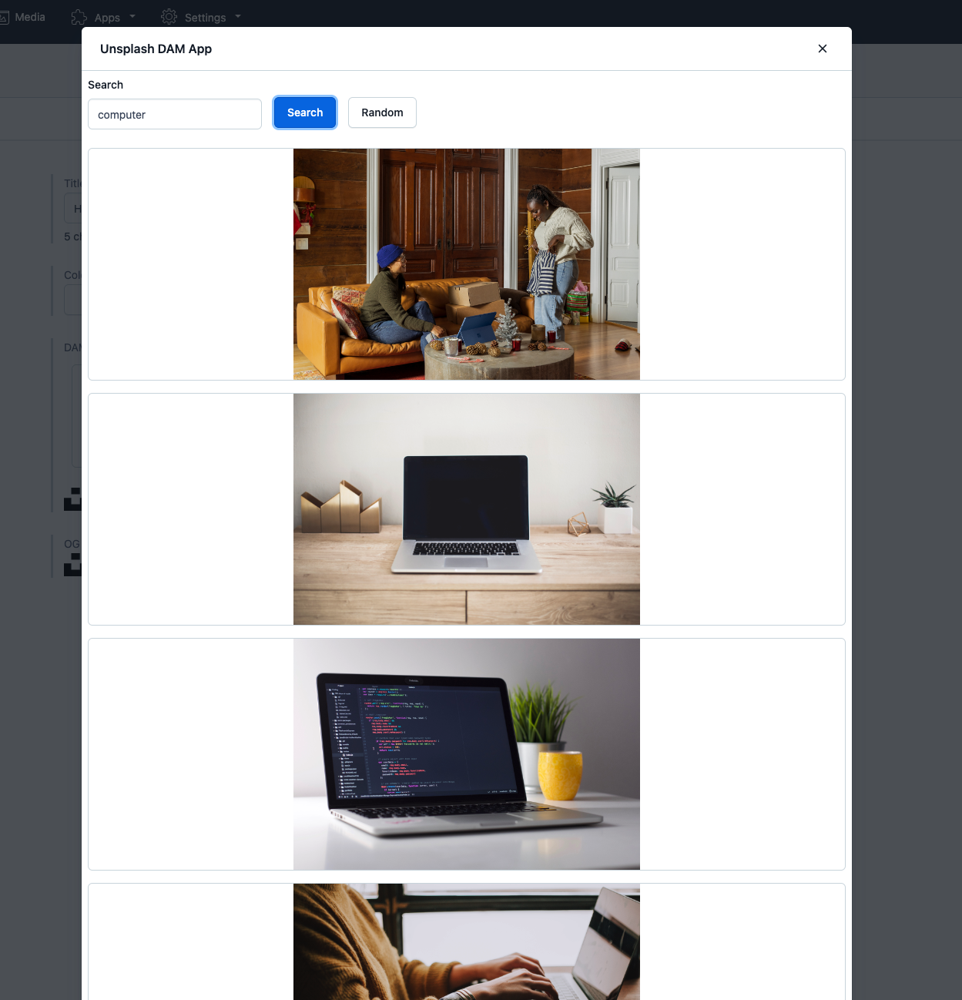

# Unsplash DAM App

A Contentful DAM app to fetch images from [Unsplash](https://unsplash.com/).

## How to use

### 1. Get Unsplash API Key

To use the app you need the Unspalsh API key. Create a [developer account](https://unsplash.com/documentation#creating-a-developer-account) and [register your app](https://unsplash.com/documentation#registering-your-application) to generate the API Key.

### 2. Install the app in your space

Click on the button below to install the app.

**NOTE:** The app works with JSON field type. Make sure your content type has a JSON field type.

Select the Space and Environment where you want to install the app.

On the configuration screen, enter your Unsplash API Key.

## Contribute

Want to help make the app better? We are open to contribution. If you find a bug, open an issue, or if you want a new feature, feel to open a PR 🎉
